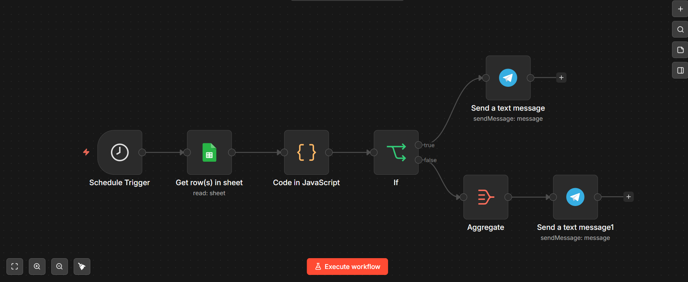
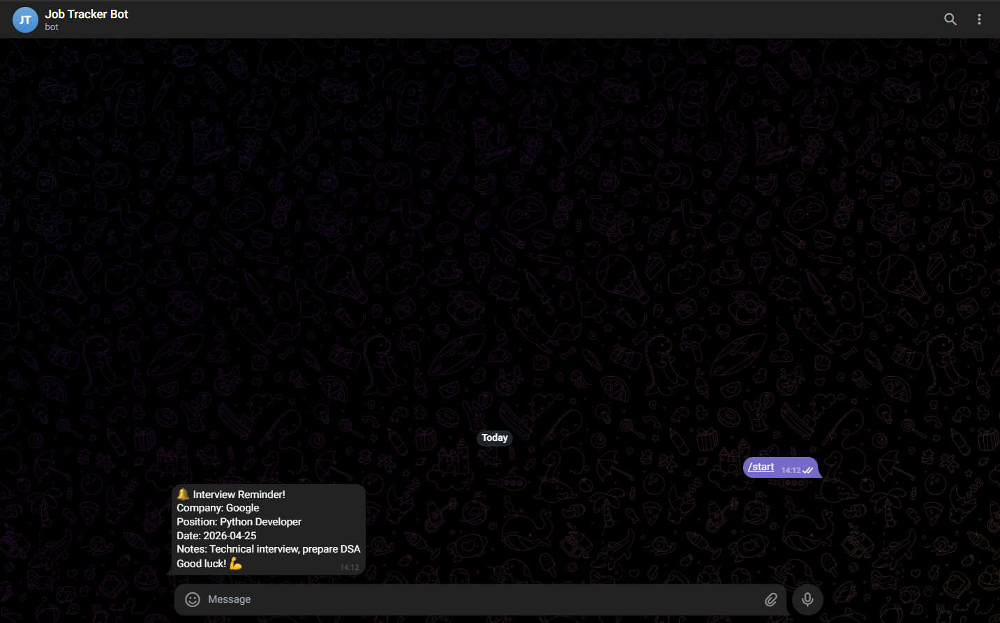
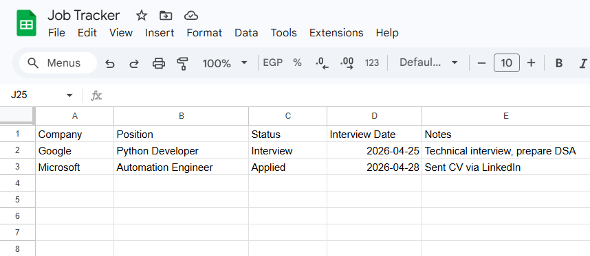

# Smart Job Application Tracker 🎯

An automated job application tracking system that monitors your applications in Google Sheets and sends Telegram reminders before upcoming interviews — built with n8n and running 24/7 on Railway.

## Features
- Reads job applications from Google Sheets daily
- Sends Telegram reminder 2 days before interviews
- Sends daily summary of all active applications
- Smart IF condition — only notifies for Interview status
- Error handling with dedicated error workflow
- Hosted on Railway — runs 24/7 without your computer

## Tech Stack
- **n8n** — workflow automation
- **Google Sheets** — application database
- **Telegram Bot** — notifications and reminders
- **Railway** — cloud hosting

## How It Works
Schedule Trigger (daily)
↓
Google Sheets (read applications)
↓
Code (convert date format)
↓
IF Condition (Status = Interview AND date within 2 days?)
↓ True                    ↓ False
Telegram reminder         Telegram daily summary

## Google Sheets Structure
| Company | Position | Status | Interview Date | Notes |
|---------|----------|--------|----------------|-------|
| Google | Python Developer | Interview | 2026-04-25 | Prepare DSA |
| Microsoft | Automation Engineer | Applied | 2026-04-28 | Sent via LinkedIn |

**Status options:** `Applied` / `Interview` / `Rejected` / `Offer`

## Setup

### 1. Import workflow
- Download `workflow.json`
- Import into your n8n instance

### 2. Configure credentials
- Google Sheets OAuth2
- Telegram Bot Token (create via @BotFather)
- Your Telegram Chat ID (get via @userinfobot)

### 3. Set up Google Sheet
Create a sheet with these columns:
Company | Position | Status | Interview Date | Notes

### 4. Activate workflow
- Set Schedule Trigger to daily
- Publish the workflow

## Hosting
This workflow runs on **Railway** — a cloud platform that keeps n8n alive 24/7 without needing your computer to be on.

Deploy your own:
1. Create account at railway.app
2. Deploy n8n template
3. Import workflow.json
4. Add credentials
5. Activate

## Screenshots

### Workflow

### Telegram Reminder

### Google Sheets

## Key Concepts Demonstrated
- **Conditional Logic** — IF node with multiple AND conditions
- **Date Handling** — converting string dates to ISO format in JavaScript
- **Google Sheets Integration** — reading live data from spreadsheets
- **Telegram Bot** — sending formatted notifications
- **Error Handling** — dedicated error workflow with Telegram alerts
- **Cloud Deployment** — hosting automation on Railway

## Author
**Ahmed El-Telbani**
Automation Engineer | Python | n8n | AI Workflows

